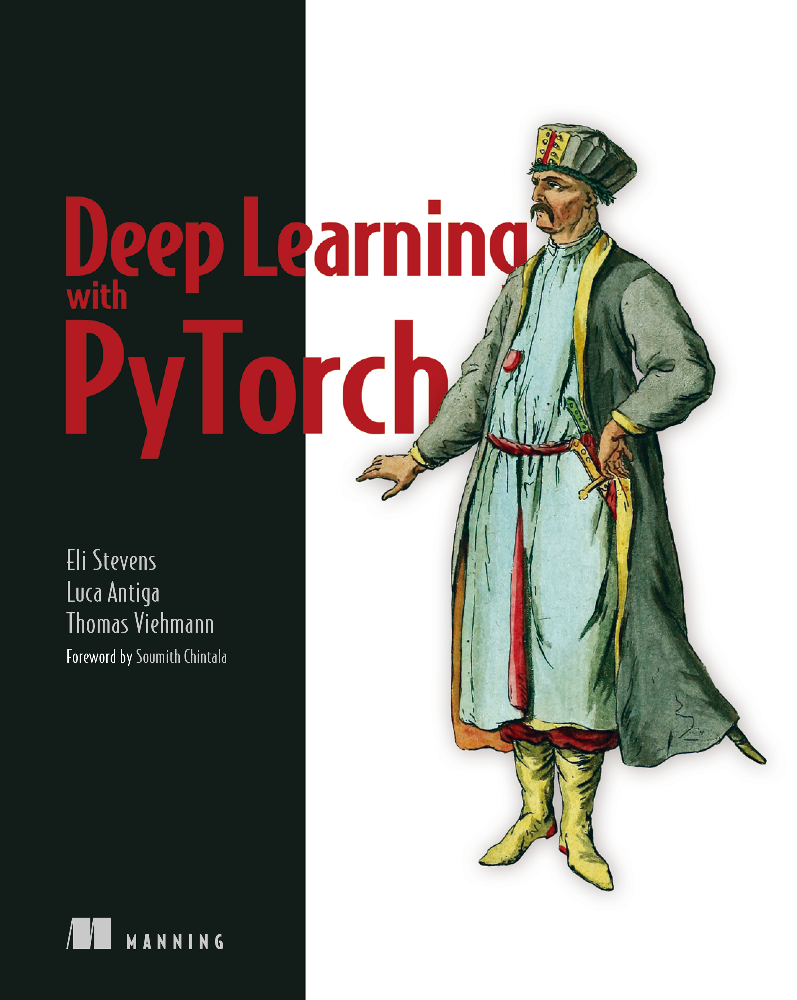
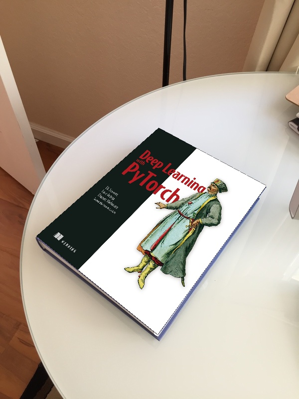

# Homography warping example

 <table align="center">
  <tr>
    <td></td>
    <td></td>
    <td></td>
  </tr>
  <tr>
    <td>deep-learning-with-pytorch-1.png</td>
    <td>book1.jpg</td>
    <td>blended.jpg</td>
  </tr>
</table>
